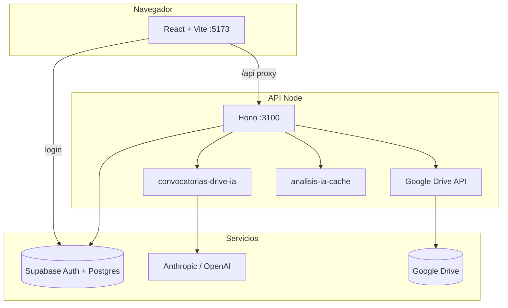
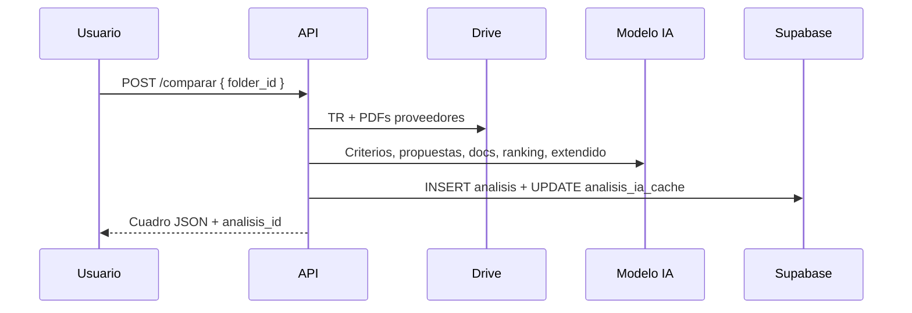

# HSG · Cuadro comparativo de licitaciones

Dashboard web para **comparar propuestas de proveedores** a partir de carpetas en Google Drive. Extrae criterios y documentación de los Términos de Referencia (TR), analiza PDFs con IA, genera ranking, análisis por criterio y cuadro de documentación — y guarda cada ejecución en Supabase para consultarla después.

> **Manual para usuarios (equipo HSG):** **[docs/MANUAL-USUARIO.md](./docs/MANUAL-USUARIO.md)** — inicio de sesión, Drive, Comparar, TR manual, aclaraciones, pestañas del cuadro, informe PDF y preguntas frecuentes. Puedes compartir ese archivo o exportarlo a PDF.

<p align="center">
  <strong>React · Hono · Supabase · Google Drive · Claude / OpenAI</strong>
</p>

---

## Tabla de contenidos

- [Manual de usuario (resumen)](#manual-de-usuario-resumen)
- [Características](#características)
- [Arquitectura](#arquitectura)
- [Estructura en Google Drive](#estructura-en-google-drive)
- [Flujo de uso](#flujo-de-uso)
- [Requisitos](#requisitos)
- [Instalación](#instalación)
- [Variables de entorno](#variables-de-entorno)
- [Base de datos](#base-de-datos)
- [Proveedor de IA](#proveedor-de-ia)
- [Caché de IA](#caché-de-ia)
- [API REST](#api-rest)
- [Estructura del repositorio](#estructura-del-repositorio)
- [Scripts](#scripts)
- [Despliegue](#despliegue)
- [Documentación adicional](#documentación-adicional)

---

## Manual de usuario (resumen)

La guía completa está en **[docs/MANUAL-USUARIO.md](./docs/MANUAL-USUARIO.md)**. Resumen para el día a día:

1. **Iniciar sesión** con el correo que te dio el administrador.
2. **Navegar** en el panel izquierdo hasta la carpeta del **servicio** (ej. Aseo, Tubería).
3. **Configurar evaluación** si hace falta: TR en Drive, pegar texto del TR o definir criterios manuales (mín. 2).
4. Pulsar **Comparar** y esperar 2–8 min sin cerrar la pestaña.
5. Si aparece **Aclaraciones antes de comparar**, responder con datos concretos (periodicidad de precios, pesos, etc.) y continuar.
6. Revisar pestañas: **Resumen**, **Análisis general**, **Criterios**, **Financiero**, **Documentación**.
7. Opcional: **Descargar informe PDF (Top 3)**.
8. **Historial** en la misma carpeta o **Ya analizadas** para volver a un análisis anterior.

**Drive:** subcarpeta por proveedor *o* un PDF suelto por proveedor en la carpeta del servicio. TR en carpeta central con nombre tipo `TR HSG (NombreServicio).pdf`.

---

## Características

| Área | Descripción |
|------|-------------|
| **Navegación Drive** | Explorador de carpetas y PDFs desde la raíz de convocatorias. |
| **Comparar** | Pipeline IA: TR → criterios + docs exigidos → extracción por proveedor → documentación → ranking → análisis extendido. |
| **TR flexible** | TR en Drive, texto pegado o criterios definidos a mano. |
| **Aclaraciones** | Si la confianza es &lt; 90 %, pregunta al usuario antes de comparar (sin suposiciones). |
| **Flywheel** | Aprendizaje persistente de correcciones y aclaraciones (mejora en comparaciones del mismo servicio). |
| **Vistas del cuadro** | Resumen, análisis general por criterio, criterios y ofertas, financiero, documentación estándar. |
| **Informe PDF** | Descarga con Top 3, cuadro comparativo y enlaces a Drive. |
| **Historial** | Cada comparación persiste en `analisis`; historial por carpeta de servicio. |
| **Acceso rápido** | En el home, tarjetas **Ya analizadas** con salto directo al análisis y a la carpeta. |
| **Caché IA** | Reutiliza extracciones cuando TR, PDFs y archivos no cambian (menos tokens y tiempo). |
| **Auth** | Supabase Auth (email/contraseña); API protegida con JWT. |

---

## Arquitectura



| Capa | Tecnología | Puerto (local) |
|------|------------|----------------|
| Frontend | React 19, Vite 8, Tailwind CSS 4 | `5173` |
| Backend | Hono, Node 20+, TypeScript | `3100` |
| Datos | Supabase (Postgres + RLS) | — |
| Archivos | Google Drive (service account, solo lectura) | — |
| IA | Anthropic Claude u OpenAI (`LLM_PROVIDER`) | — |

En desarrollo, Vite hace **proxy** de `/api` al API (`vite.config.ts`, timeout 10 min para `comparar`).

---

## Estructura en Google Drive

Convención esperada por la aplicación:

```
GOOGLE_DRIVE_ROOT_FOLDER_ID/          ← Raíz (conjuntos / edificios)
└── [Conjunto]/
    └── [Servicio]/                   ← Carpeta donde se pulsa «Comparar»
        ├── Proveedor A/              ← Modo A: subcarpetas = oferentes
        │   └── *.pdf
        ├── Proveedor B/
        └── ...

    — o modo B (ej. TUBERIA): PDFs sueltos en la carpeta del servicio
        ├── Empresa_X - Propuesta.pdf   ← cada PDF = un proveedor
        └── Empresa_Y.pdf

GOOGLE_DRIVE_TERMINOS_FOLDER_ID/      ← Carpeta central de TR (compartida)
├── TR HSG (Aseo).docx
├── TR HSG - Tuberia.pdf
└── ...
```

- El **TR** no va dentro de la carpeta del servicio: se resuelve en la carpeta central por **nombre del servicio** (p. ej. carpeta `ACQUA` → `TR HSG (ACQUA).docx`).
- **Modo A:** cada subcarpeta directa = un proveedor. **Modo B:** cada PDF en la carpeta de servicio = un proveedor.
- Si no hay TR en Drive: **pegar texto** o **criterios manuales** en «Configurar evaluación».
- Formatos de TR: `.docx`, `.pdf` o Google Docs (exportados a DOCX).

Detalle para usuarios: [docs/MANUAL-USUARIO.md](./docs/MANUAL-USUARIO.md) y [docs/GUIA_DRIVE.md](./docs/GUIA_DRIVE.md).

---

## Flujo de uso (técnico)

1. Iniciar sesión (usuario creado en Supabase Auth).
2. Navegar hasta la **carpeta de servicio** (subcarpetas de proveedores o PDFs sueltos).
3. Configurar TR: Drive automático, texto pegado o criterios manuales.
4. Pulsar **Comparar**; si `confianza_pct` &lt; 90, responder aclaraciones y reintentar.
5. Revisar pestañas del cuadro e informe PDF opcional.
6. Historial / **Ya analizadas** para consultas posteriores.



---

## Requisitos

- **Node.js** 22 recomendado en local (`nvm use 22`; Node 20 requiere workaround WebSocket con Supabase)  
- Proyecto **Supabase** (Auth + Postgres)  
- **Service account** de Google Cloud con acceso de lectura a las carpetas de Drive  
- API key de **Anthropic** y/o **OpenAI** según `LLM_PROVIDER`  

---

## Instalación

```bash
git clone https://github.com/soporte-svg/hsg-licitaciones.git
cd hsg-licitaciones
npm install
cp .env.example .env
# Editar .env con tus credenciales
```

### 1. Credenciales Google

1. Crear service account en Google Cloud Console.  
2. Activar **Google Drive API**.  
3. Descargar JSON y guardarlo en `secrets/` (no se versiona).  
4. Compartir carpetas raíz y de términos con el `client_email` del JSON (lector).  

### 2. Supabase

1. Crear proyecto en [supabase.com](https://supabase.com).  
2. Ejecutar migraciones (ver [Base de datos](#base-de-datos)).  
3. En **Authentication → Users**, crear usuarios con email/contraseña.  
4. Copiar URL, `anon` key y `service_role` key al `.env`.  

### 3. Arranque en local

```bash
npm run dev
```

- API: http://localhost:3100/health  
- App: http://localhost:5173  

---

## Variables de entorno

Copia `.env.example` → `.env`. **No subas `.env` ni `secrets/` al repositorio.**

### Frontend (prefijo `VITE_`)

| Variable | Descripción |
|----------|-------------|
| `VITE_SUPABASE_URL` | URL del proyecto Supabase |
| `VITE_SUPABASE_ANON_KEY` | Clave anónima (login en el navegador) |
| `VITE_API_URL` | Vacío en local (usa proxy). En producción: URL pública del API |

### API y Supabase

| Variable | Descripción |
|----------|-------------|
| `SUPABASE_SERVICE_ROLE_KEY` | Solo servidor; escritura en `analisis` y caché |
| `LICITACIONES_API_PORT` | Puerto del API (default `3100`) |
| `LICITACIONES_WEB_ORIGIN` | Origen CORS del front (ej. `http://localhost:5173`) |

### Inteligencia artificial

| Variable | Descripción |
|----------|-------------|
| `LLM_PROVIDER` | `anthropic` (default) u `openai` |
| `ANTHROPIC_API_KEY` | Requerida si `LLM_PROVIDER=anthropic` |
| `ANTHROPIC_MODEL` | Default `claude-sonnet-4-6` |
| `OPENAI_API_KEY` | Requerida si `LLM_PROVIDER=openai` |
| `OPENAI_MODEL` | Default `gpt-4o` (recomendado con PDFs) |
| `OPENAI_BASE_URL` | Opcional (proxy / compatible OpenAI) |
| `LLM_TIMEOUT_MS` | Timeout en ms (default `300000`) |
| `LLM_MAX_TOKENS_ANALISIS_EXTENDIDO` | Salida máx. análisis extendido (default `16384`) |

### Google Drive

| Variable | Descripción |
|----------|-------------|
| `DRIVE_CREDENTIALS_JSON` | Ruta al JSON del service account |
| `GOOGLE_DRIVE_ROOT_FOLDER_ID` | ID carpeta raíz de propuestas |
| `GOOGLE_DRIVE_TERMINOS_FOLDER_ID` | ID carpeta central de TR |

### Límites del comparador (opcional)

| Variable | Default | Descripción |
|----------|---------|-------------|
| `COMPARAR_MAX_PDFS_PER_PROVEEDOR` | `6` | PDFs enviados a IA por proveedor |
| `COMPARAR_MAX_PDF_BYTES` | `4194304` | Tamaño máximo por PDF (4 MB) |

---

## Base de datos

Migraciones en `supabase/migrations/` (ejecutar **en orden**):

| Archivo | Contenido |
|---------|-----------|
| `001_analisis.sql` | Tabla `analisis`, RLS por email |
| `002_analisis_documentacion.sql` | Columna `documentacion` (JSONB) |
| `003_analisis_extendido.sql` | Columna `analisis_extendido` (JSONB) |
| `004_analisis_ia_cache.sql` | Tabla `analisis_ia_cache` por `folder_id` |
| `005_flywheel_aprendizaje.sql` | Tabla `flywheel_aprendizaje` (aclaraciones y correcciones Endir) |

**Opción A — SQL Editor** (Supabase Dashboard): pegar y ejecutar cada archivo.

**Opción B — CLI:**

```bash
cd licitaciones
supabase link --project-ref TU_PROJECT_REF
supabase db push
```

La tabla `analisis_ia_cache` solo la escribe el API con **service role** (no hay políticas RLS para clientes).

---

## Proveedor de IA

Una sola variable elige el backend:

```env
LLM_PROVIDER=anthropic   # o openai
```

Implementación en `server/lib/llm-provider.ts`. Los logs del API muestran `[ia/claude]` o `[ia/openai]`.

- **Anthropic**: PDFs como bloques `document` nativos.  
- **OpenAI**: PDFs como `file` en Chat Completions (`data:application/pdf;base64,...`).  

Mismo flujo de prompts en `server/lib/convocatorias-drive-ia.ts` para ambos proveedores.

---

## Caché de IA

Tabla `analisis_ia_cache` (clave: `folder_id` de la carpeta de **servicio**):

- Evita repetir extracción de TR, PDFs por proveedor y clasificación documental si no cambian archivos/huellas.  
- Cada **Comparar** sigue creando una fila nueva en `analisis` (historial completo).  
- La respuesta incluye `reutilizado_ia` (`terminos_tr`, `documentacion`, `proveedores`) para depuración.

---

## API REST

Base: `/api/convocatorias-drive`  
Autenticación: `Authorization: Bearer <access_token>` (sesión Supabase).

| Método | Ruta | Descripción |
|--------|------|-------------|
| `GET` | `/health` | Estado del API |
| `GET` | `/browse?parent_id=` | Carpetas y PDFs hijos |
| `GET` | `/terminos?folder_id=` | TR vinculado al servicio |
| `GET` | `/pdf?file_id=` | Stream PDF inline |
| `POST` | `/comparar` | Body: `folder_id`, `fuente_terminos`, `terminos_texto`, `criterios_manual`, `clarificaciones` |
| `POST` | `/preparar-comparar` | Vista previa: confianza, preguntas, criterios |
| `POST` | `/extraer-criterios-texto` | Body: `{ "terminos_texto": "..." }` |
| `POST` | `/flywheel` | Registrar corrección / nota Endir |
| `GET` | `/analisis/:id/informe-pdf` | Descarga informe PDF Top 3 |
| `GET` | `/analisis-recientes?limit=30` | Últimos análisis del usuario (home) |
| `GET` | `/analisis?folder_id=` | Historial por carpeta |
| `GET` | `/analisis/:id` | Detalle de un análisis |

Respuestas habituales: `{ "data": ..., "error": null }` o `{ "data": null, "error": { "code", "message" } }`.

Detalle de códigos de error y payloads: [docs/API.md](./docs/API.md).

---

## Estructura del repositorio

```
licitaciones/
├── public/                 # Assets estáticos (logo, favicon)
├── src/                      # Frontend React
│   ├── App.tsx               # UI principal (Drive + cuadro)
│   ├── api.ts                # Cliente HTTP
│   └── lib/supabase.ts       # Cliente Auth
├── server/
│   ├── index.ts              # Entrada Hono + CORS
│   ├── routes/
│   │   └── convocatorias-drive.ts
│   └── lib/
│       ├── drive.ts          # Google Drive
│       ├── convocatorias-drive-ia.ts
│       ├── llm-provider.ts   # Anthropic / OpenAI
│       ├── analisis-ia-cache.ts
│       └── json.ts           # Parseo JSON del modelo
├── supabase/migrations/      # Esquema Postgres
├── scripts/                  # Utilidades Drive (desarrollo)
├── docs/                     # Documentación extendida
├── .env.example
└── package.json
```

---

## Scripts

| Comando | Descripción |
|---------|-------------|
| `npm run dev` | API + Vite (espera `/health`) |
| `npm run dev:api` | Solo API con recarga |
| `npm run dev:web` | Solo Vite |
| `npm run build` | `tsc` + build de producción |
| `npm run preview` | Vista previa del build |
| `npm run lint` | ESLint |

---

## Despliegue

**Todo en Vercel (recomendado):** front + API serverless en el mismo dominio. No hace falta `VITE_API_URL`. Ver **[docs/DESPLIEGUE.md](./docs/DESPLIEGUE.md)** (Opción A).

En Vercel usa `GOOGLE_SERVICE_ACCOUNT_KEY` (JSON inline), no la ruta `secrets/`. Comparar largo requiere **Vercel Pro** (timeout hasta 300 s).

**Alternativa:** front en Vercel + API en Render (`VITE_API_URL` apuntando al API externo) — Opción B en la guía.

---

## Documentación adicional

| Documento | Contenido |
|-----------|-----------|
| **[docs/MANUAL-USUARIO.md](./docs/MANUAL-USUARIO.md)** | **Manual completo para el equipo HSG (usuarios finales)** |
| [docs/ARQUITECTURA.md](./docs/ARQUITECTURA.md) | Pipeline de comparación, módulos y decisiones técnicas |
| [docs/API.md](./docs/API.md) | Referencia de endpoints y errores |
| [docs/GUIA_DRIVE.md](./docs/GUIA_DRIVE.md) | Convenciones de carpetas y nombres de TR |
| [docs/DESPLIEGUE.md](./docs/DESPLIEGUE.md) | Vercel + API (Render/Railway), CORS y variables |

---

## Licencia y soporte

Proyecto privado **HSG**. Para incidencias o mejoras, usar el repositorio interno o contactar al equipo de desarrollo.
