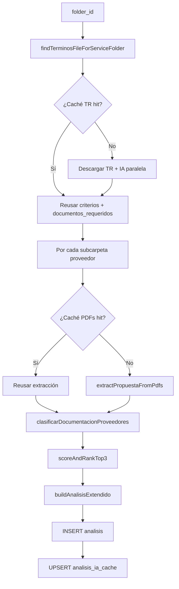

# Arquitectura técnica

Documento de referencia para desarrolladores del dashboard de licitaciones HSG.

## Principios

- **Monorepo ligero**: un solo `package.json`; front y API en el mismo repositorio.
- **Drive como fuente de verdad** de archivos; Supabase solo persiste resultados de análisis.
- **IA stateless por request**: el estado intermedio vive en `analisis_ia_cache` entre ejecuciones.
- **Seguridad**: credenciales de Drive y `service_role` solo en servidor; RLS en `analisis` por email.

## Pipeline `POST /comparar`

Orden aproximado en `server/routes/convocatorias-drive.ts`:

### Etapas de IA (`convocatorias-drive-ia.ts`)

| Función | Entrada | Salida |
|---------|---------|--------|
| `extractCriteriosFromTerminosDocument` | TR (docx/pdf) | `CriterioRow[]` |
| `extractDocumentosRequeridosFromTerminos` | TR | Lista documental exigida |
| `extractPropuestaFromPdfs` | PDFs + criterios | `PropuestaExtract` por proveedor |
| `clasificarDocumentacionProveedores` | Requisitos + nombres de archivo | Matriz requisito × proveedor |
| `scoreAndRankTop3` | Criterios + propuestas | Ranking y top 3 |
| `buildAnalisisExtendido` | Criterios + propuestas | Bullets por criterio + bloque financiero |

Todas las llamadas pasan por `completeLlmText` en `llm-provider.ts`.

## Caché (`analisis-ia-cache.ts`)

| Campo | Uso |
|-------|-----|
| `terminos_file_id` | Si cambia el TR en Drive, invalida criterios y docs |
| `proveedores_extracciones` | Huella de IDs de PDF por carpeta proveedor |
| `doc_req_fp` / `doc_drive_fp` | Huellas para reutilizar asignación documental |
| `doc_asignaciones` | Resultado crudo; se re-enriquece con `file_id` al leer Drive |

## Autenticación

1. Front: `supabase.auth.signInWithPassword` → `access_token`.
2. Cada `fetch` a `/api/*` envía `Authorization: Bearer <token>`.
3. Middleware `requireAuth`: `supabaseAdmin.auth.getUser(token)` y `userEmail` en contexto.
4. Inserciones en `analisis` usan `created_by = userEmail`.

## Frontend (`App.tsx`)

- **Estado de navegación**: `crumbs[]` → `currentParentId` para Drive.
- **Vista de análisis**: `analisisGuardado` (histórico) o `compararResult` (último comparar).
- **Pestañas**: `cuadroTab` → resumen, general, evaluación, financiero, documentación.
- **Recientes**: solo en raíz Drive; `GET /analisis-recientes`.

## Dependencias clave

| Paquete | Rol |
|---------|-----|
| `hono` | Router HTTP |
| `googleapis` | Drive v3 readonly |
| `mammoth` | DOCX → texto para TR |
| `@anthropic-ai/sdk` / `openai` | Modelos |
| `@supabase/supabase-js` | Auth + DB admin |
| `zod` | Validación de respuestas IA |

## Puntos de extensión

- Nuevo proveedor IA: ampliar `llm-provider.ts`.
- Nuevas columnas en cuadro: migración SQL + `buildAnalisisExtendido` + pestaña en `App.tsx`.
- Otros formatos de propuesta: `extractPropuestaFromPdfs` y límites `COMPARAR_*`.
