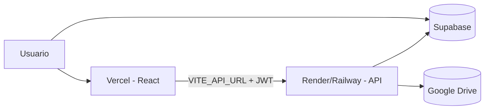

# Despliegue en producción

El proyecto tiene **dos partes** que no pueden vivir solo en Vercel estático:

| Parte | Qué es | Dónde desplegar |
|-------|--------|------------------|
| **Frontend** | React (`dist/`) | **Vercel** (recomendado) |
| **API** | Node + Hono (`server/`) | **Railway**, **Render**, Fly.io, VPS, etc. |

El login usa **Supabase** directo desde el navegador (funciona en Vercel).  
Las carpetas de Drive y **Comparar** pasan por el API: si el API no está arriba o `VITE_API_URL` falla, verás *«No se pudo conectar con el API»*.

> **Comparar** puede tardar 5–15 minutos. Vercel Serverless tiene límite de tiempo (~60 s en hobby); **no** uses Vercel solo para el API. Usa un servicio con proceso Node largo y timeout alto.

---

## Checklist rápido

- [ ] API desplegado y `https://tu-api.../health` devuelve `{"status":"ok",...}`
- [ ] En **Vercel** → Environment Variables → `VITE_API_URL=https://tu-api...` (sin `/` final)
- [ ] En el **API** → `LICITACIONES_WEB_ORIGIN=https://tu-app.vercel.app` (o varias URLs separadas por coma)
- [ ] Mismas variables de Supabase, IA y Google Drive en el API que en local
- [ ] **Redeploy** de Vercel después de cambiar `VITE_*` (se inyectan en el build)

---

## 1. Desplegar el API (ejemplo Render)

1. Crea un **Web Service** conectado al repo `hsg-licitaciones`.
2. **Root directory:** `licitaciones` (si el repo es el monorepo padre, ajusta la ruta).
3. **Build command:** `npm install`
4. **Start command:** `npm run start:api`
5. **Plan:** el que permita timeouts largos para `POST /comparar`.

### Variables de entorno en Render (API)

Copia desde tu `.env` local, adaptando:

| Variable | Notas |
|----------|--------|
| `PORT` | Lo asigna Render automáticamente |
| `LICITACIONES_WEB_ORIGIN` | `https://tu-proyecto.vercel.app` |
| `SUPABASE_SERVICE_ROLE_KEY` | Igual que local |
| `VITE_SUPABASE_URL` | Opcional; `load-env` la reutiliza si falta `SUPABASE_URL` |
| `LLM_PROVIDER`, claves IA | Igual que local |
| `GOOGLE_DRIVE_ROOT_FOLDER_ID` | Igual que local |
| `GOOGLE_DRIVE_TERMINOS_FOLDER_ID` | Igual que local |
| `GOOGLE_SERVICE_ACCOUNT_KEY` | **Pega el JSON completo** del service account (una línea). En Render no subas `secrets/` |

Alternativa a JSON inline:

```env
DRIVE_CREDENTIALS_JSON=/etc/secrets/google.json
```

(solo si tu plataforma monta archivos secretos).

6. Anota la URL pública, ej. `https://hsg-licitaciones-api.onrender.com`.

7. Prueba en el navegador: `https://hsg-licitaciones-api.onrender.com/health`

---

## 2. Desplegar el frontend en Vercel

1. Importa el repo en [vercel.com](https://vercel.com).
2. **Framework:** Vite (detectado por `vercel.json`).
3. **Root directory:** `licitaciones` si aplica.

### Variables en Vercel (Environment Variables)

| Variable | Valor |
|----------|--------|
| `VITE_SUPABASE_URL` | URL Supabase |
| `VITE_SUPABASE_ANON_KEY` | Anon key |
| `VITE_API_URL` | URL del API del paso 1, **sin barra final** |

Ejemplo:

```env
VITE_API_URL=https://hsg-licitaciones-api.onrender.com
```

4. **Deploy**. Si cambias `VITE_API_URL`, haz **Redeploy** (no basta guardar la variable).

---

## 3. CORS

El API acepta varios orígenes si los separas por coma:

```env
LICITACIONES_WEB_ORIGIN=https://hsg-licitaciones.vercel.app,https://hsg-licitaciones-git-main.vercel.app
```

Incluye la URL de producción y, si usas previews, el dominio `*.vercel.app` de preview (añade la URL exacta que muestre Vercel en cada deploy de rama).

---

## 4. Errores frecuentes

### «No se pudo conectar con el API»

| Causa | Solución |
|-------|----------|
| Solo desplegaste Vercel | Despliega el API y configura `VITE_API_URL` |
| `VITE_API_URL` vacía en el build | Añádela en Vercel y **redeploy** |
| `VITE_API_URL` apunta a `localhost` | Usa la URL **pública** del API |
| API dormido (free tier Render) | Primera petición tarda ~1 min; espera o usa plan sin sleep |
| CORS | Añade tu dominio Vercel en `LICITACIONES_WEB_ORIGIN` |

### Login OK pero sin carpetas

Supabase funciona; el fallo es solo el API (Drive). Revisa `/health` y variables Google.

### Comparar corta a los 60 s

El proxy/plataforma del API tiene timeout bajo. Sube el límite a **600 s** o más en Render/Railway/nginx.

---

## 5. Supabase

- Auth: en Supabase → Authentication → URL Configuration, añade la URL de Vercel en **Site URL** / redirect URLs si usas magic links (email/password suele bastar con anon key).
- Migraciones: ejecutar `supabase/migrations/*.sql` en el proyecto de producción.

---

## Diagrama


