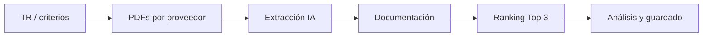

# Manual de usuario — Cuadro comparativo HSG

Guía para el equipo que evalúa licitaciones con la herramienta **HSG · Cuadro comparativo**. No requiere conocimientos técnicos.

---

## 1. ¿Qué hace esta herramienta?

Permite **comparar propuestas de varios proveedores** para un mismo servicio (aseo, tubería, vigilancia, etc.):

1. Lee los **Términos de Referencia (TR)** y obtiene los **criterios de evaluación** (pesos, tipos, unidades).
2. Lee los **PDF de cada proveedor** en Google Drive.
3. Extrae valores ofertados por criterio con **inteligencia artificial**.
4. Cruza **documentación** exigida en el TR con los archivos de cada proveedor.
5. Genera **ranking (Top 3)**, análisis por criterio, resumen ejecutivo e **informe PDF**.

Cada vez que pulsas **Comparar**, se guarda un análisis en el historial (no se sobrescribe el anterior).

---

## 2. Acceso

1. Abre la URL de la aplicación (la que te indique el equipo de sistemas).
2. Inicia sesión con el **correo y contraseña** que te crearon en el sistema.
3. Si no tienes usuario, pide al administrador que te dé de alta en Supabase Auth.

> La sesión es personal: solo ves los análisis creados con tu mismo correo.

---

## 3. Pantalla principal

| Zona | Para qué sirve |
|------|----------------|
| **Panel izquierdo (Drive)** | Navegar carpetas, filtrar, abrir PDFs, pulsar **Comparar** |
| **Panel derecho (Cuadro)** | Ver resultados: resumen, análisis, criterios, financiero, documentación |
| **Ya analizadas** | Acceso rápido a comparaciones hechas antes |
| **Migas de pan** | Volver a carpetas superiores (conjunto, raíz) |

---

## 4. Cómo debe estar organizado Google Drive

### 4.1 Carpetas que usa el sistema

Hay **dos ubicaciones** importantes (configuradas por el administrador):

| Carpeta | Contenido |
|---------|-----------|
| **Raíz de convocatorias** | Conjuntos / edificios → servicios → proveedores |
| **Carpeta central de TR** | Un solo lugar con todos los Términos de Referencia |

El TR **no** va dentro de la carpeta del servicio; vive en la carpeta central y el sistema lo **vincula por nombre** al servicio que estás evaluando.

### 4.2 Estructura típica (un proveedor por subcarpeta)

```
Raíz Drive/
└── NOMBRE CONJUNTO/          (ej. ACQUA, EDIFICIO X)
    └── NOMBRE SERVICIO/       ← Aquí entras y pulsas «Comparar»
        ├── PROVEEDOR A/
        │   ├── Propuesta.pdf
        │   ├── RUT.pdf
        │   └── ...
        ├── PROVEEDOR B/
        └── PROVEEDOR C/
```

- Cada **subcarpeta directa** bajo el servicio = **un proveedor**.
- Los PDF dentro de esa subcarpeta son los que analiza la IA (prioriza propuesta económica / oferta).

### 4.3 Estructura alternativa (un PDF = un proveedor)

Algunos servicios tienen **solo PDFs sueltos** en la carpeta del servicio (sin subcarpetas), por ejemplo:

```
└── TUBERIA/
    ├── Empresa_A - Propuesta.pdf
    ├── Empresa_B - Oferta.pdf
    └── Empresa_C.pdf
```

En ese caso **cada archivo PDF** se trata como **un proveedor** (el nombre del archivo identifica al oferente).

### 4.4 Nombres del TR en la carpeta central

Para que el sistema encuentre el TR automáticamente, el archivo debe:

- Estar en la **carpeta central de términos** (no dentro del servicio).
- Llevar en el nombre la palabra **TR** o **términos**, y relacionarse con el servicio.

**Ejemplos que funcionan bien:**

- `TR HSG (Aseo).docx`
- `TR HSG - Tuberia.pdf`
- `Terminos Vigilancia HSG.docx`

**Regla práctica:** el nombre del archivo TR debe contener algo parecido al **nombre de la carpeta del servicio** (ej. carpeta `TUBERIA` → TR con «Tuberia» en el nombre).

Formatos admitidos: **PDF** o **Word (.docx)**.

---

## 5. Configurar la evaluación (Términos de referencia)

Antes de comparar, despliega **«Configurar evaluación (TR / criterios)»** en el panel izquierdo.

Puedes elegir **tres fuentes**:

| Opción | Cuándo usarla |
|--------|----------------|
| **TR en Drive** | El sistema ya encontró el archivo en la carpeta central («TR vinculado»). Es el modo habitual. |
| **Pegar texto del TR** | No hay TR en Drive o quieres usar un extracto. Pega el texto (matriz de evaluación, criterios, pesos) y pulsa **Extraer criterios con IA**. |
| **Criterios manuales** | Defines tú mismo al menos **2 criterios**: nombre, peso %, tipo (económico, técnico, experiencia, jurídico), unidad (ej. `COP/mes`) y qué se evalúa. |

**Recomendación:** en criterios económicos indica siempre la **unidad** (mensual, anual, total contrato) para evitar comparar cifras incompatibles.

---

## 6. Comparar paso a paso

1. **Navega** hasta la carpeta del **servicio** (con subcarpetas de proveedores o PDFs sueltos).
2. **Configura** el TR (sección anterior) si no aparece «TR vinculado».
3. Comprueba que el botón **Comparar** esté habilitado (hay proveedores y TR configurado).
4. Pulsa **Comparar**.
5. **Espera 2–8 minutos** (según cantidad de proveedores y PDFs). **No cierres la pestaña** mientras dice «Comparando…».
6. Revisa el cuadro en el panel derecho.

### 6.1 Preguntas de aclaración (confianza &lt; 90 %)

Si falta información o hay ambigüedad (pesos, periodicidad del precio, criterios incompletos), aparecerá un cuadro **«Aclaraciones antes de comparar»**.

- Responde **todas** las preguntas con datos concretos (no dejes campos vacíos).
- Pulsa **Continuar comparación**.
- Si aún no hay suficiente claridad, el sistema puede **volver a preguntar** hasta tener confianza ≥ 90 %.

Ejemplo de respuesta útil: *«El criterio precio es valor mensual en pesos colombianos»* en lugar de *«el del TR»*.

### 6.2 Qué hace el sistema por detrás (resumen)



---

## 7. Pestañas del cuadro comparativo

Tras comparar (o al abrir un análisis del **Historial**), usa las pestañas:

| Pestaña | Contenido |
|---------|-----------|
| **Resumen** | Síntesis ejecutiva, veredicto por proveedor, hallazgos por criterio con confianza de extracción |
| **Análisis general** | Texto ampliado por criterio del TR |
| **Criterios y ofertas** | Tabla de valores extraídos vs criterios |
| **Financiero** | Comparativo de propuesta económica (con advertencia si las periodicidades no coinciden) |
| **Documentación** | Matriz requisito del TR × proveedor × archivo encontrado en Drive |

### 7.1 Confianza de extracción

En varias vistas verás **alta**, **media** o **baja**:

- **Alta:** el dato aparece claro en los PDF analizados.
- **Media / baja:** revisar manualmente en Drive; puede afectar el puntaje.

### 7.2 Documentación

El cruce se hace principalmente por **nombre de archivo** en la carpeta del proveedor, no leyendo el contenido interno de todos los PDF. Si un requisito aparece vacío, puede que el archivo exista con otro nombre.

### 7.3 Informe PDF

Con un análisis abierto, usa **Descargar informe PDF (Top 3)** para obtener un PDF con ranking, cuadro resumido y enlaces a archivos en Drive.

---

## 8. Historial y «Ya analizadas»

- **Historial** (en la carpeta del servicio): lista de comparaciones anteriores en esa carpeta; clic para volver a ver el resultado.
- **Ya analizadas** (inicio): acceso rápido a los últimos análisis de tu usuario en cualquier carpeta.

Cada **Comparar** crea un registro **nuevo**; los anteriores no se borran.

---

## 9. Mejora continua (Flywheel / Endir)

Las **respuestas de aclaración** y las correcciones del equipo se guardan para **mejorar comparaciones futuras** del mismo servicio (menos errores repetidos en extracción y ranking).

Si detectas un error sistemático (ej. siempre confunde mensual vs total), repórtalo al equipo para registrar una **nota de corrección** en el sistema.

---

## 10. Limitaciones importantes

| Tema | Detalle |
|------|---------|
| **Tiempo** | Una comparación puede tardar varios minutos; no recargues la página a mitad. |
| **PDFs por proveedor** | Solo se analizan los PDF más relevantes (límite configurado, p. ej. 6 archivos); prioriza propuesta/oferta. |
| **Tamaño PDF** | Archivos muy grandes pueden omitirse. |
| **Precios** | Comparar solo si todos los proveedores usan la misma **periodicidad** (mensual vs total). |
| **Documentación** | Basada en nombres de archivo; no sustituye revisión legal de contenidos. |
| **IA** | Los resultados son apoyo a la decisión; la evaluación final es responsabilidad del equipo HSG. |

---

## 11. Problemas frecuentes

| Problema | Qué hacer |
|----------|-----------|
| **Comparar deshabilitado** | Entra a la carpeta del servicio; debe haber subcarpetas o PDFs. Configura TR (Drive, texto o manual). |
| **Sin TR en carpeta central** | Usa **Pegar texto del TR** o **Criterios manuales**, o sube/renombra el TR en la carpeta central. |
| **TR vinculado incorrecto** | Revisa el nombre del archivo TR vs nombre de la carpeta servicio; contacta soporte si persiste. |
| **Cuadro vacío en documentación** | El TR no listó documentos o los archivos del proveedor no coinciden por nombre. |
| **Precios incomparables** | Responde la aclaración de periodicidad o corrige criterios manuales con unidad `COP/mes` o `total contrato`. |
| **Error al comparar** | Espera unos minutos y reintenta; si falla, avisa a soporte con nombre del servicio y hora. |
| **No veo análisis de un compañero** | Cada usuario solo ve sus propios análisis (mismo correo de login). |

---

## 12. Glosario

| Término | Significado |
|---------|-------------|
| **TR** | Términos de Referencia del servicio a licitar |
| **Criterio** | Ítem evaluable (precio, experiencia, etc.) con peso % |
| **Proveedor / oferente** | Empresa que presentó propuesta |
| **Top 3** | Los tres mejores puntajes según la IA y los pesos del TR |
| **Carpeta de servicio** | Carpeta donde están las propuestas de un mismo servicio |
| **Conjunto** | Edificio o agrupación (carpeta padre del servicio) |

---

## 13. Soporte

Para incidencias, nuevos usuarios o cambios en Drive/IA, contacta al **equipo de desarrollo HSG** o al repositorio interno del proyecto.

*Versión del manual: alineada con TR manual, aclaraciones de confianza y flywheel de aprendizaje.*
